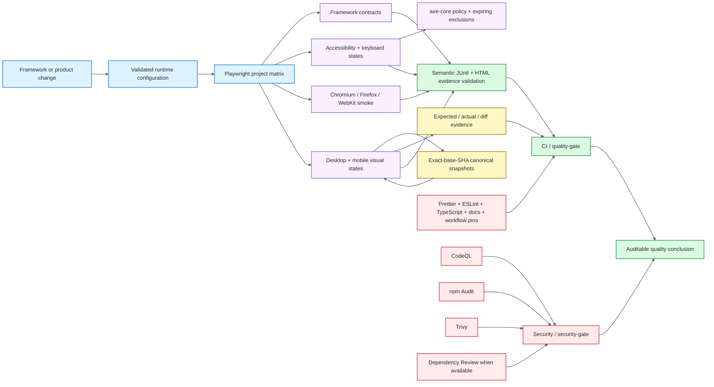

# Visual & Accessibility QA Automation — Playwright + axe-core

[](https://github.com/portyu9/qa-automation-visual-and-accessibility-playwright-axe/actions/workflows/ci.yml)
[](https://github.com/portyu9/qa-automation-visual-and-accessibility-playwright-axe/actions/workflows/security.yml)
[](https://github.com/portyu9/qa-automation-visual-and-accessibility-playwright-axe/actions/workflows/visual-baseline.yml)

[](https://playwright.dev/)
[](https://github.com/dequelabs/axe-core)
[](https://www.typescriptlang.org/)
[](https://nodejs.org/)
[](https://www.w3.org/WAI/standards-guidelines/wcag/)
[](docs/adr-001-visual-baseline-artifacts.md)
[](https://github.com/features/actions)
[](https://trivy.dev/)
[](LICENSE)
[](SECURITY.md)

A TypeScript quality-engineering framework for two browser-quality signals that are often tested separately but fail for many of the same state-management reasons: **visual regression** and **accessibility**.

Playwright owns deterministic browser execution, projects, interaction, traces, screenshots, reporting, and pixel comparison. `@axe-core/playwright` supplies automated accessibility-rule evaluation. Repository-owned fixtures, evidence validators, baseline-governance workflows, and independent security gates turn those libraries into a repeatable system rather than a collection of browser scripts.

The default target is a deterministic local application owned by this repository, so required framework health does not depend on a public demo service. The same architecture can target an explicitly approved HTTP(S) environment through `BASE_URL`.

> [!IMPORTANT]
> A visual diff is a **change detector**, not a correctness oracle. An axe pass is an **automated rule-engine result**, not WCAG certification. The framework combines multiple independent signals and preserves their limits instead of allowing one green check to claim coverage it cannot provide.

**Read by intent:** [quality model](#quality-and-oracle-model) · [architecture](#architecture) · [determinism](#determinism-before-tolerance) · [accessibility](#accessibility-policy) · [visual baselines](#visual-baseline-lifecycle) · [evidence](#evidence-as-a-first-class-test-output) · [CI/security](#ci-and-evidence-gates) · [dependencies](#dependency-maintenance) · [repository map](#repository-map)

## Quality and oracle model

High-confidence browser quality depends on separating **what is observed** from **what can legitimately judge it**. This framework keeps distinct oracles because rendering, semantic accessibility, keyboard interaction, cross-browser behavior, and supply-chain risk are different failure domains.

<!-- prettier-ignore -->
| Validation plane | Primary oracle | What it can prove | What it deliberately does not claim |
| --- | --- | --- | --- |
| Framework contracts | TypeScript + Playwright contract tests | Configuration, helpers, policy boundaries and fixture behavior | Product correctness |
| Accessibility rules | axe-core WCAG rules | Detectable violations in the rendered DOM/accessibility state | Complete WCAG conformance or human usability |
| Keyboard and focus | Playwright behavioral assertions | Focus movement, skip links, dialogs, validation focus and operability | Screen-reader interpretation or cognitive clarity |
| Visual regression | Playwright image matcher | Governed pixels changed beyond explicit thresholds | Whether a changed design is semantically correct |
| Cross-browser smoke | Playwright browser projects | Critical behavior survives Chromium, Firefox and WebKit | Pixel-identical rendering across engines |
| Baseline provenance | Controlled Visual Baseline workflow | Canonical pixels correspond to a successful exact `main` SHA | Approval of the underlying design |
| Evidence semantics | JUnit/HTML/baseline validators | Intended suites, hosts and artifacts actually executed/appeared | Application correctness by itself |
| Static quality | Prettier, ESLint, TypeScript, docs and workflow-pin contracts | Repository policy remains internally consistent | Runtime behavior |
| Supply chain | CodeQL, npm Audit, Trivy, Dependency Review | Independent source/dependency/configuration/secret risk signals | Absence of every possible vulnerability |

The value is in the **intersection of evidence**. A page can be visually stable and inaccessible, semantically valid and visually broken, axe-clean but keyboard-inoperable, or cross-browser functional while only one engine exposes a layout defect. Those conditions should remain separately diagnosable.

## Architecture



The architecture intentionally separates four responsibilities:

1. **Configuration decides where execution is allowed to go.** Invalid target or port state fails before navigation.
2. **Browser projects decide compatibility dimensions.** Test code does not duplicate engine policy.
3. **Domain helpers own durable quality policy.** Accessibility exclusions, visual stabilization, and evidence semantics live outside individual tests.
4. **CI decides whether the evidence is trustworthy.** Exit code `0` is necessary, but not sufficient, proof that the intended tests actually ran.

For the deeper layer model and trust boundaries, see [Architecture](docs/architecture.md).

## Engineering invariants

<!-- prettier-ignore -->
| Concern | Framework contract |
| --- | --- |
| Determinism | Locale, timezone, color scheme, reduced motion, font readiness, service-worker behavior, fixture data and dynamic masks are controlled before tolerance is widened. |
| Baseline storage | Canonical PNGs are workflow artifacts, not committed source churn. |
| Baseline provenance | PR visual comparison resolves a successful baseline for the exact pull-request base SHA and fails closed when it is unavailable. |
| Mismatch preservation | Intentional visual-change handling preserves the original expected/actual/diff evidence before candidate generation. |
| Accessibility debt | Every exclusion carries selector, reason, issue/reference and future ISO expiry; malformed or expired exclusions fail configuration. |
| Negative harness proof | Known invalid fixture states prove axe can detect expected `button-name` and `image-alt` defects. |
| Evidence identity | Successful lanes validate JUnit structure, zero failures/errors, intended suite identity, expected project hosts, executed-test floors and non-trivial HTML evidence. |
| Skip semantics | Skipped tests do not inflate execution evidence. |
| Browser policy | Chromium owns canonical visual baselines; Firefox and WebKit provide functional compatibility evidence. |
| Install trust | CI uses `npm ci --ignore-scripts`; browser installation is an explicit reviewable step. |
| Supply chain | CodeQL, npm Audit, Trivy and Dependency Review remain independent controls. |
| Workflow integrity | Third-party Actions are full-SHA pinned and validated by repository policy. |
| Least privilege | Workflows start read-only and grant additional permissions only where required. |

## Determinism before tolerance

Visual regression becomes unreliable when environmental noise is mistaken for product change. The framework therefore treats screenshot stability as an input-control problem before treating it as a matcher-threshold problem.

<!-- prettier-ignore -->
| Source of visual entropy | Framework response |
| --- | --- |
| Fonts | Wait for `document.fonts.ready` before comparison |
| Animation/caret state | Reduced motion plus Playwright screenshot stabilization |
| Dynamic regions | Explicit masks only for elements carrying the dynamic-content contract |
| Locale/timezone | Controlled Playwright context values |
| Color preference | Stable light color scheme |
| Service workers | Blocked for deterministic repository-owned execution |
| Responsive state | Named desktop/mobile projects rather than ad hoc viewport mutation |
| Fixture data | Repository-owned deterministic application state |
| Browser engine | Canonical visual coverage intentionally scoped to Chromium projects |
| Baseline host | Controlled Linux CI generates canonical snapshots |

A global tolerance increase is the broadest possible suppression. It should be the last response to noise, after the source of nondeterminism has been isolated and controlled.

## Quick start

The qualified toolchain is Node.js with npm. `.nvmrc` pins Node and `packageManager` pins npm.

```bash
npm install --global --ignore-scripts npm
npm ci --ignore-scripts
npx playwright install --with-deps
npm run check
npm test
```

The default Playwright configuration starts the deterministic local application automatically.

<!-- prettier-ignore -->
| Command | Purpose |
| --- | --- |
| `npm run check` | Formatting, lint, types, documentation and immutable workflow-pin contracts |
| `npm run test:framework` | Browser-independent framework/configuration contracts under Chromium |
| `npm run test:smoke` | Chromium, Firefox and WebKit critical-path compatibility |
| `npm run test:accessibility` | Chromium axe plus keyboard/state accessibility suite |
| `npm run test:visual` | Desktop/mobile Chromium visual and integration comparison |
| `npm run visual:update` | Generate local candidate snapshots for investigation |
| `npm test` | Full configured Playwright project matrix |
| `npm run report` | Open the latest Playwright HTML report |

## Runtime target policy

`BASE_URL` is parsed before browser work starts. It must be an absolute `http` or `https` URL without embedded credentials, query string, or fragment. `TEST_PORT` must be a complete integer in the valid TCP range. Invalid configuration fails at the environment boundary instead of surfacing later as opaque navigation or server-startup errors.

```bash
BASE_URL=https://qa.example.internal npm run test:accessibility
```

<!-- prettier-ignore -->
| Variable | Default | Meaning |
| --- | --- | --- |
| `BASE_URL` | `http://127.0.0.1:4173` | Approved application target |
| `TEST_PORT` | `4173` | Deterministic local-site port; integer 1–65535 |
| `CI` | supplied by CI | Enables CI retry/worker/report behavior |

A product integration should add authorization, authentication, test-data, tenancy, environment allowlisting, and state-changing-test policy at the integration boundary. A reusable browser harness should not assume that every syntactically valid URL is operationally safe to test.

## Accessibility policy

The shared auditor runs WCAG A/AA tags and explicitly enables axe's `target-size` rule. Scans can target the whole document or a named component/state. Each scan attaches raw JSON and a Markdown summary containing rule IDs, impact, help links, affected selectors, exclusion metadata, and incomplete checks requiring human review.

Three boundaries remain explicit:

- **Violations fail unless explicitly governed.** Exclusions are validated before axe executes, and expired/malformed debt cannot silently hide a defect.
- **Incomplete checks remain visible.** An axe result that requires human judgment is not converted into a synthetic pass.
- **Behavioral accessibility stays behavioral.** Keyboard navigation, focus restoration, modal focus, skip navigation, and validation focus are asserted separately because a static rule engine cannot infer all interaction semantics.

Automated analysis is not represented as WCAG certification. Screen-reader usability, meaningful reading/focus order, content semantics in context, cognitive accessibility, zoom/reflow judgment, alternative-input usability, and other human-dependent criteria require manual review. See [Accessibility testing](docs/accessibility-testing.md) and the [Manual accessibility checklist](docs/manual-accessibility-checklist.md).

## Visual baseline lifecycle

Canonical screenshots are environment-sensitive test oracles. Their provenance therefore matters as much as their pixels.

1. Every `main` SHA generates desktop Chromium and mobile Chromium snapshots in controlled Linux CI.
2. The generated suite is rerun against those snapshots, proving the baseline set is internally usable.
3. CI validates Playwright evidence and requires at least the governed minimum of 12 PNG baselines.
4. The snapshot tree is uploaded as an artifact associated with that successful workflow run and commit SHA.
5. A pull request resolves the successful baseline run for its **exact base SHA** and downloads those snapshots.
6. The PR renders the same governed states and compares them with Playwright's native image matcher.
7. An unapproved mismatch fails and preserves expected/actual/diff evidence.
8. If `visual-change-approved` is present, original mismatch evidence remains preserved before a candidate baseline is generated.
9. The candidate suite is rerun and semantically validated; candidate generation is not itself proof that the change is acceptable.
10. After merge, the new `main` SHA becomes canonical only through a fresh Visual Baseline run.
11. A weekly refresh keeps canonical artifacts available within the configured retention window.

This prevents a pull request from redefining its expected pixels before comparison with the state it proposes to replace. See [Visual regression strategy](docs/visual-regression.md) and [ADR-001: CI artifact visual baselines](docs/adr-001-visual-baseline-artifacts.md).

## Evidence as a first-class test output

A robust automation system distinguishes **test execution** from **evidence of test execution**. This repository validates both.

Playwright command success is followed by repository-owned checks that verify:

- structurally valid JUnit;
- zero failures/errors for successful lanes;
- intended suite identity;
- exact governed project-host attribution where required;
- non-trivial executed-test floors;
- skipped cases cannot inflate execution count;
- non-trivial HTML reporting;
- meaningful PNG baseline/candidate counts when visual artifacts are expected.

The visual lane is governed as **12 executions across six exact visual identities on Chromium and mobile Chromium**, so a renamed/missing project cannot be disguised by a coincidentally correct total count. Unknown governed evidence tokens fail closed.

That catches failure modes a normal process exit can miss: renamed test directories, empty matrix slices, reporter regressions, accidental discovery loss, missing artifacts, or a visual job that technically ran but did not produce the intended baseline set.

## CI and evidence gates

`CI` separates browser-quality planes before aggregation:

- `quality` — exact npm qualification, script-disabled install, formatting/lint/type/docs/workflow-pin checks, framework contracts, semantic evidence validation, and HIGH/CRITICAL npm advisory gating;
- `accessibility` — Chromium accessibility/state suite plus semantic JUnit/HTML validation;
- `smoke` — Chromium/Firefox/WebKit matrix with per-engine semantic evidence validation and retained reports;
- `visual` — exact-base baseline retrieval, comparison, intentional-change governance, candidate verification, and retained comparison evidence;
- `quality-gate` — stable conclusion that fails unless all event-relevant CI planes reached an acceptable result.

The dedicated `Security` workflow contains independent controls:

- CodeQL `security-extended` analysis for JavaScript/TypeScript;
- a clean script-disabled npm install followed by HIGH/CRITICAL advisory gating with machine-readable evidence;
- Trivy filesystem scanning for fixed HIGH/CRITICAL vulnerabilities, supported misconfiguration, and committed-secret findings;
- semantic Trivy evidence validation requiring npm `package-lock.json` attribution with real package name/version identities;
- pull-request Dependency Review when GitHub Dependency graph is available;
- `security-gate` — stable aggregation of event-applicable security planes.

Dependency Review availability is probed explicitly. When GitHub Dependency graph is unavailable, the workflow records that service limitation instead of implying that repository-wide scanners are equivalent to change-aware dependency-diff analysis.

The stable repository-facing status interfaces are `CI / quality-gate` and `Security / security-gate`.

The separate Visual Baseline workflow owns canonical baseline generation, immediate re-verification, semantic visual-evidence validation, a meaningful PNG assertion, and retained baseline/evidence artifacts.

## Failure interpretation

<!-- prettier-ignore -->
| Signal | First interpretation |
| --- | --- |
| Framework contract failure | Harness/configuration policy changed or regressed |
| axe violation | Detectable accessibility rule failure in rendered state |
| Keyboard/focus failure | Interaction semantics or focus-management regression |
| Visual mismatch | Governed pixels changed; review intent before updating expectations |
| Cross-browser-only failure | Engine compatibility or timing/rendering difference |
| Missing exact-base baseline | Baseline provenance/retention problem, not permission to use another SHA |
| Evidence-validator failure | Intended tests/projects/artifacts were not proven to have executed correctly |
| npm Audit / Trivy / CodeQL failure | Independent dependency/repository/source-security signal |
| Dependency Review unavailable | GitHub service capability gap; repository-wide scans continue but are not equivalent |

Failure taxonomy matters because the cheapest correct response depends on the failed boundary. A visual mismatch should not be "fixed" by weakening axe policy, and an unavailable baseline should not be bypassed with pixels from an unrelated commit.

## Dependency maintenance

Dependencies are exact-pinned in `package.json` and reproduced by `package-lock.json`. Dependabot owns npm and GitHub Actions update proposals. The TypeScript major line remains constrained until the installed `typescript-eslint` release declares support for a newer major; minor/patch maintenance remains enabled.

Automated dependency proposals receive the same qualification as human-authored changes. They still have to satisfy runtime/static checks, framework contracts, browser execution, semantic evidence, security scanning, and visual-governance rules applicable to the files they change.

## Repository map

Only directories are shown.

```text
.
├── .github/
│   └── workflows/
├── docs/
├── framework/
│   ├── accessibility/
│   └── visual/
├── scripts/
├── test-site/
│   └── fixtures/
└── tests/
    ├── accessibility/
    ├── fixtures/
    ├── framework/
    ├── integration/
    ├── smoke/
    └── visual/
```

Root configuration files define the pinned runtime/toolchain, Playwright projects/reporters, TypeScript compiler policy, ESLint/Prettier policy, dependency graph, and command surface; they are intentionally omitted from the directory-only map.

## Extension boundaries

The framework is opinionated about **quality mechanics** while remaining application-neutral. Product-specific integrations can add:

- authenticated storage-state/session fixtures;
- API-backed test-data builders and cleanup contracts;
- page/component models when they reduce cognitive load rather than merely wrap locators;
- environment authorization and destination allowlists;
- application-specific visual masks with an explicit nondeterminism reason;
- accessibility exclusion registries integrated with an issue/debt system;
- screen-reader/manual-test evidence links;
- external observability, defect-management, or release-gate integrations.

The useful abstraction boundary is policy ownership. New helpers should centralize a durable rule, lifecycle, safety boundary, or evidence contract. An abstraction that only renames a Playwright or axe method increases indirection without increasing quality.

## Further documentation

- [Architecture](docs/architecture.md)
- [Accessibility testing](docs/accessibility-testing.md)
- [Visual regression strategy](docs/visual-regression.md)
- [CI quality gates](docs/ci-quality-gates.md)
- [Manual accessibility checklist](docs/manual-accessibility-checklist.md)
- [ADR-001: CI artifact visual baselines](docs/adr-001-visual-baseline-artifacts.md)
- [Contributing](CONTRIBUTING.md)
- [Security policy](SECURITY.md)

A mature visual/accessibility framework optimizes for **controlled inputs, trustworthy oracles, bounded exceptions, attributable failures, and evidence that proves the intended quality checks actually executed**—not for the largest number of screenshots or automated rules.
