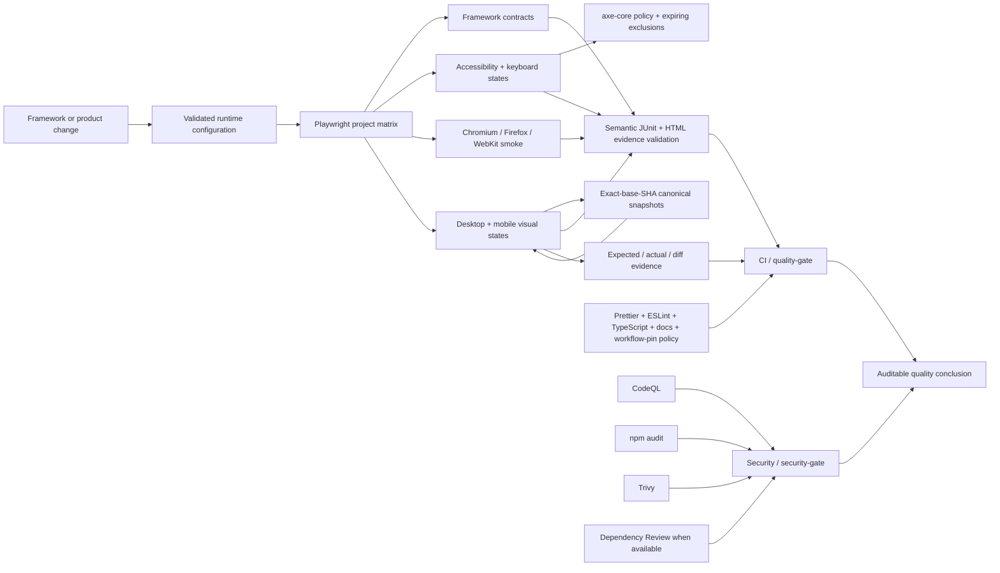

# Visual & Accessibility QA Automation — Playwright + axe-core

[](https://github.com/portyu9/qa-automation-visual-and-accessibility-playwright-axe/actions/workflows/ci.yml)
[](https://github.com/portyu9/qa-automation-visual-and-accessibility-playwright-axe/actions/workflows/security.yml)
[](https://github.com/portyu9/qa-automation-visual-and-accessibility-playwright-axe/actions/workflows/visual-baseline.yml)

[](https://playwright.dev/)
[](https://github.com/dequelabs/axe-core)
[](https://www.typescriptlang.org/)
[](https://nodejs.org/)
[](https://www.w3.org/WAI/standards-guidelines/wcag/)
[](LICENSE)

A TypeScript quality-engineering framework for two browser-quality signals that are often tested separately but fail for many of the same state-management reasons: **visual regression** and **accessibility**.

Playwright owns deterministic browser execution, projects, interaction, traces, screenshots, reporting, and pixel comparison. `@axe-core/playwright` supplies automated accessibility-rule evaluation. Repository-owned fixtures, evidence validators, security gates, and baseline-governance workflows turn those libraries into a repeatable test system rather than a collection of browser scripts.

The default target is a deterministic local application owned by this repository, so framework health does not depend on a public demo service. The same architecture can target an explicitly approved HTTP(S) environment through `BASE_URL`.

> [!IMPORTANT]
> A visual diff is a **change detector**, not a correctness oracle. An axe pass is an **automated rule-engine result**, not WCAG certification. The framework keeps those limitations explicit and combines multiple independent oracles instead of letting one signal claim coverage it cannot provide.

**Read by intent:** [quality model](#quality-and-oracle-model) · [architecture](#architecture) · [determinism](#determinism-before-tolerance) · [accessibility](#accessibility-policy) · [visual baselines](#visual-baseline-lifecycle) · [CI evidence](#ci-and-evidence-gates) · [dependencies](#dependency-maintenance) · [extension boundaries](#extension-boundaries)

## Quality and oracle model

High-confidence browser testing depends on separating **what is being observed** from **what can legitimately judge it**. This framework uses distinct oracles because no single browser assertion can prove rendering, semantics, interaction, and accessibility together.

| Validation plane    | Primary oracle                                                 | What it can prove                                                  | What it deliberately does not claim               |
| ------------------- | -------------------------------------------------------------- | ------------------------------------------------------------------ | ------------------------------------------------- |
| Framework contracts | TypeScript + Playwright contract tests                         | Configuration, helpers, policy boundaries, fixture behavior        | Product correctness                               |
| Accessibility rules | axe-core WCAG rules                                            | Detectable rule violations in the rendered accessibility/DOM state | Complete WCAG conformance or human usability      |
| Keyboard and focus  | Playwright behavioral assertions                               | Focus movement, operability, skip links, dialogs, validation focus | Screen-reader interpretation or cognitive clarity |
| Visual regression   | Playwright image matcher                                       | Governed pixels changed beyond explicit thresholds                 | Whether a changed design is semantically correct  |
| Cross-browser smoke | Playwright browser projects                                    | Critical behavior survives Chromium, Firefox, and WebKit           | Pixel-identical rendering across engines          |
| Static quality      | Prettier, ESLint, TypeScript, documentation/workflow contracts | Source and repository policy remain internally consistent          | Runtime behavior                                  |
| Supply chain        | CodeQL, npm audit, Trivy, Dependency Review                    | Independent source/dependency/configuration/secret risk signals    | Absence of every possible vulnerability           |
| Baseline provenance | Controlled Visual Baseline workflow                            | Canonical pixels correspond to a successful exact `main` SHA       | Approval of the underlying product design         |

The value is in the **intersection of evidence**. A page can be visually stable and inaccessible, semantically valid and visually broken, axe-clean but keyboard-inoperable, or cross-browser functional while only one engine exposes a layout defect. Those are different failure domains and should remain diagnosable as such.

## Architecture



The architecture intentionally separates four responsibilities:

1. **Configuration decides where execution is allowed to go.** Invalid target or port state fails before navigation.
2. **Browser projects decide compatibility dimensions.** Test code does not duplicate engine policy.
3. **Domain helpers own durable quality policy.** Accessibility exclusions, visual stabilization, and evidence semantics live outside individual tests.
4. **CI decides whether the evidence is trustworthy.** A command returning exit code `0` is necessary, but not sufficient, proof that the intended tests actually ran.

For the deeper layer model and trust boundaries, see [Architecture](docs/architecture.md).

## Engineering invariants

- **Deterministic before tolerant.** Locale, timezone, color scheme, reduced motion, font readiness, service-worker behavior, fixture data, and dynamic masks are controlled before screenshot thresholds are widened.
- **Baselines are evidence, not source churn.** Canonical PNGs are generated by controlled Linux CI and retained as workflow artifacts instead of being committed to the repository.
- **PR comparisons use the exact base SHA.** A pull request fails closed when the successful canonical baseline for `github.event.pull_request.base.sha` cannot be resolved.
- **The first mismatch is preserved.** An intentional visual-change path cannot erase the evidence that triggered review before candidate regeneration occurs.
- **Accessibility debt has an expiry date.** Every exclusion requires a selector, reason, issue/reference, and ISO expiry date; stale suppressions fail configuration instead of silently surviving.
- **The harness proves negative behavior.** An intentionally invalid fixture verifies that axe detects known `button-name` and `image-alt` defects, protecting against a test harness that only knows how to pass.
- **Evidence is semantic.** Successful Playwright lanes validate JUnit structure, zero failures/errors, intended-suite identity, minimum executed-test counts, and a non-trivial HTML report.
- **Skipped tests do not become execution evidence.** Evidence floors represent tests that actually ran, preventing discovery regressions from being disguised by metadata alone.
- **Install scripts are not implicit trust.** CI uses `npm ci --ignore-scripts`; Playwright browser installation is an explicit, reviewable step.
- **Security controls remain independent.** CodeQL, npm advisory scanning, Trivy, and Dependency Review cover different attack surfaces and are not treated as interchangeable.
- **Workflow dependencies are executable code.** Third-party Actions are full-SHA pinned and a repository-local validator prevents mutable tags from reappearing unnoticed.
- **Least privilege is the starting state.** Workflows begin read-only and grant additional token permissions only to the jobs that require them.

## Determinism before tolerance

Visual testing becomes unreliable when environmental noise is mistaken for product change. The framework therefore treats screenshot stability as an input-control problem before treating it as a matcher-threshold problem.

| Source of visual entropy | Framework response                                                        |
| ------------------------ | ------------------------------------------------------------------------- |
| Fonts                    | Wait for `document.fonts.ready` before comparison                         |
| Animation/caret state    | Reduced motion plus Playwright screenshot stabilization                   |
| Dynamic regions          | Explicit masks only for elements carrying the dynamic-content contract    |
| Locale/timezone          | Controlled Playwright context values                                      |
| Responsive state         | Named desktop/mobile projects rather than ad hoc viewport mutation        |
| Fixture data             | Repository-owned deterministic application state                          |
| Browser engine           | Canonical visual coverage stays intentionally scoped to Chromium projects |
| Baseline host            | Controlled Linux CI generates canonical snapshots                         |

A global tolerance increase is the broadest possible suppression. It should be the last response to noise, after the source of nondeterminism has been isolated and controlled.

## Quick start

The qualified toolchain is Node.js **24.20.0 LTS** with npm **11.19.1**. `.nvmrc` pins Node and `packageManager` pins npm.

```bash
npm install --global --ignore-scripts npm@11.19.1
npm ci --ignore-scripts
npx playwright install --with-deps
npm run check
npm test
```

The default Playwright configuration starts the deterministic local application automatically.

### Command reference

| Command                      | Purpose                                                                          |
| ---------------------------- | -------------------------------------------------------------------------------- |
| `npm run check`              | Formatting, lint, types, documentation, and immutable workflow-pin contracts     |
| `npm run test:framework`     | Browser-independent framework/configuration contracts under the Chromium project |
| `npm run test:smoke`         | Chromium, Firefox, and WebKit critical-path compatibility                        |
| `npm run test:accessibility` | Chromium axe plus keyboard/state accessibility suite                             |
| `npm run test:visual`        | Desktop/mobile Chromium visual and integration comparison                        |
| `npm run visual:update`      | Generate local candidate snapshots for investigation                             |
| `npm test`                   | Full configured Playwright project matrix                                        |
| `npm run report`             | Open the latest Playwright HTML report                                           |

## Runtime target policy

`BASE_URL` is parsed before browser work starts. It must be an absolute `http` or `https` URL and must not embed credentials, a query string, or a fragment. `TEST_PORT` must be a complete integer in the valid TCP range. Invalid configuration fails at the environment boundary instead of surfacing later as an opaque navigation or server-startup error.

```bash
BASE_URL=https://qa.example.internal npm run test:accessibility
```

| Variable    | Default                 | Meaning                                        |
| ----------- | ----------------------- | ---------------------------------------------- |
| `BASE_URL`  | `http://127.0.0.1:4173` | Approved application target                    |
| `TEST_PORT` | `4173`                  | Deterministic local-site port; integer 1–65535 |
| `CI`        | supplied by CI          | Enables CI retry/worker/report behavior        |

A product integration should add authorization, authentication, test-data, tenancy, environment allowlisting, and state-changing-test policy at the integration boundary. A reusable browser harness should not assume that every syntactically valid URL is operationally safe to test.

## Accessibility policy

The shared auditor runs WCAG 2.0/2.1/2.2 A/AA tags and explicitly enables axe's `target-size` rule. A scan can target the whole document or a named component/state. Each scan attaches raw JSON and a Markdown summary containing rule IDs, impact, help links, affected selectors, exclusion metadata, and incomplete checks requiring human review.

The policy has three important boundaries:

- **Violations are failures unless explicitly governed.** Exclusions are validated before axe executes, and expired/malformed debt cannot silently hide a defect.
- **Incomplete checks remain visible.** An axe result that requires human judgment is not converted into a synthetic pass.
- **Behavioral accessibility stays behavioral.** Keyboard navigation, focus restoration, modal focus, skip navigation, and validation focus are asserted separately because a static rule engine cannot infer all interaction semantics.

Automated accessibility analysis is not represented as WCAG certification. Screen-reader usability, meaningful reading/focus order, content semantics in context, cognitive accessibility, zoom/reflow judgment, alternative-input usability, and other human-dependent criteria require manual review. See [Accessibility testing](docs/accessibility-testing.md) and the [Manual accessibility checklist](docs/manual-accessibility-checklist.md).

## Visual baseline lifecycle

Canonical screenshots are environment-sensitive test oracles. Their provenance therefore matters as much as their pixels.

1. Every `main` SHA generates desktop Chromium and mobile Chromium snapshots in controlled Linux CI.
2. The generated suite is rerun against those snapshots, proving the baseline set is internally usable.
3. CI validates successful Playwright evidence and requires at least the governed minimum of 12 PNG baselines.
4. The snapshot tree is uploaded as an artifact associated with that successful workflow run and commit SHA.
5. A pull request resolves the successful baseline run for its **exact base SHA** and downloads those snapshots.
6. The PR renders the same governed states and compares them with Playwright's native image matcher.
7. An unapproved mismatch fails and preserves expected/actual/diff evidence.
8. If `visual-change-approved` is present, the original mismatch evidence remains preserved before a candidate baseline is generated.
9. The candidate suite is rerun and semantically validated; candidate generation is not itself proof that the change is acceptable.
10. After merge, the new `main` SHA becomes canonical only through a fresh Visual Baseline run.
11. A weekly refresh keeps canonical artifacts available within the configured retention window.

This model prevents a pull request from redefining its expected pixels before comparison with the state it actually proposes to replace. See [Visual regression strategy](docs/visual-regression.md) and [ADR-001: CI artifact visual baselines](docs/adr-001-visual-baseline-artifacts.md).

## Evidence as a first-class test output

A robust automation system distinguishes **test execution** from **evidence of test execution**. This repository validates both.

Playwright command success is followed by repository-owned checks that verify:

- the JUnit document is structurally valid;
- recorded failures/errors are zero for a successful lane;
- the intended suite identity is present;
- executed-test counts meet a non-trivial floor;
- skipped cases cannot inflate the execution count;
- the HTML report is present and non-trivial;
- visual baseline/candidate directories contain a meaningful number of PNGs when those artifacts are the expected evidence.

That catches failure modes a normal process exit can miss: renamed test directories, empty matrix slices, reporter regressions, accidental discovery loss, missing artifacts, or a visual job that technically ran but did not produce the governed baseline set.

## CI and evidence gates

`CI` separates browser-quality planes before aggregating them:

- `quality` — exact npm qualification, script-disabled install, formatting/lint/type/docs/workflow-pin checks, framework contracts, semantic evidence validation, and HIGH/CRITICAL npm advisory gating;
- `accessibility` — Chromium accessibility/state suite plus semantic JUnit/HTML validation;
- `smoke` — Chromium/Firefox/WebKit matrix with per-engine semantic evidence validation and retained reports;
- `visual` — exact-base baseline retrieval, comparison, intentional-change governance, candidate verification, and retained comparison evidence;
- `quality-gate` — stable conclusion that fails unless all event-relevant CI planes reached an acceptable result.

The dedicated `Security` workflow contains independent controls:

- CodeQL `security-extended` analysis for JavaScript/TypeScript;
- a clean script-disabled npm install followed by HIGH/CRITICAL advisory gating with machine-readable evidence;
- Trivy filesystem scanning for fixed HIGH/CRITICAL vulnerabilities, supported misconfiguration, and committed-secret findings;
- pull-request Dependency Review when GitHub Dependency graph is available;
- `security-gate` — stable aggregation of the security planes that are applicable to the event.

Dependency Review availability is probed explicitly. When GitHub Dependency graph is unavailable, the workflow records that service limitation instead of implying that repository-wide scanners are equivalent to change-aware dependency-diff analysis.

The stable repository-facing status interfaces are `CI / quality-gate` and `Security / security-gate`. Repository rules/settings are a separate governance layer; this framework keeps the workflow contract stable so that layer can consume a small, durable set of conclusions even as internal matrices evolve.

## Failure interpretation

| Signal                        | First interpretation                                                                 |
| ----------------------------- | ------------------------------------------------------------------------------------ |
| Framework contract failure    | Harness/configuration policy changed or regressed                                    |
| axe violation                 | Detectable accessibility rule failure in the rendered state                          |
| Keyboard/focus failure        | Interaction semantics or focus-management regression                                 |
| Visual mismatch               | Governed pixels changed; review intent before updating expectations                  |
| Cross-browser-only failure    | Engine compatibility or timing/rendering difference                                  |
| Missing exact-base baseline   | Baseline provenance/retention problem, not a reason to compare against another SHA   |
| Evidence-validator failure    | Intended tests/artifacts were not proven to have executed correctly                  |
| npm/Trivy/CodeQL failure      | Independent supply-chain or source-security signal                                   |
| Dependency Review unavailable | GitHub service capability gap; repository-wide scans continue but are not equivalent |

Failure taxonomy matters because the cheapest correct response depends on the failed boundary. A visual mismatch should not be "fixed" by weakening axe policy, and an unavailable baseline should not be bypassed by accepting pixels from an unrelated commit.

## Dependency maintenance

Dependencies are exact-pinned in `package.json` and reproduced by `package-lock.json`. Dependabot owns npm and GitHub Actions update proposals. The TypeScript major line remains constrained until the installed `typescript-eslint` release declares support for a newer major; minor/patch maintenance remains enabled.

An automated dependency proposal does not receive weaker treatment than a human-authored change. It still has to satisfy runtime qualification, static checks, framework contracts, browser execution, semantic evidence, security scanning, and visual-governance rules applicable to the files it changes.

## Repository map

```text
.
├── .github/
│   └── workflows/
├── docs/
├── framework/
│   ├── accessibility/
│   └── visual/
├── scripts/
├── test-site/
│   └── fixtures/
└── tests/
    ├── accessibility/
    ├── fixtures/
    ├── framework/
    ├── integration/
    ├── smoke/
    └── visual/
```

Only directories are shown in the repository map. Root configuration files define the pinned runtime/toolchain, Playwright projects/reporters, TypeScript compiler policy, ESLint/Prettier policy, dependency graph, and command surface.

## Extension boundaries

The framework is intentionally opinionated about **quality mechanics** while remaining application-neutral. Product-specific integrations can add:

- authenticated storage-state/session fixtures;
- API-backed test-data builders and cleanup contracts;
- page/component models when they reduce cognitive load rather than merely wrap locators;
- environment authorization and destination allowlists;
- application-specific visual masks with an explicit reason for nondeterminism;
- accessibility exclusion registries integrated with an issue/debt system;
- screen-reader/manual-test evidence links;
- external observability, defect-management, or release-gate integrations.

The useful abstraction boundary is policy ownership. New helpers should centralize a durable rule, lifecycle, safety boundary, or evidence contract. An abstraction that only renames a Playwright or axe method increases indirection without increasing quality.

## Further documentation

- [Architecture](docs/architecture.md)
- [Accessibility testing](docs/accessibility-testing.md)
- [Visual regression strategy](docs/visual-regression.md)
- [CI quality gates](docs/ci-quality-gates.md)
- [Manual accessibility checklist](docs/manual-accessibility-checklist.md)
- [ADR-001: CI artifact visual baselines](docs/adr-001-visual-baseline-artifacts.md)
- [Contributing](CONTRIBUTING.md)
- [Security policy](SECURITY.md)

A mature visual/accessibility framework does not optimize for the largest number of screenshots or automated rules. It optimizes for **controlled inputs, trustworthy oracles, bounded exceptions, attributable failures, and evidence that proves the intended quality checks actually executed**.
