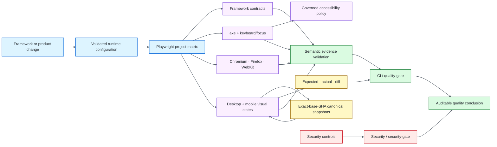

# Visual & Accessibility Quality Engineering Framework — Playwright + axe-core

[](https://github.com/portyu9/qa-automation-visual-and-accessibility-playwright-axe/actions/workflows/ci.yml)
[](https://github.com/portyu9/qa-automation-visual-and-accessibility-playwright-axe/actions/workflows/security.yml)
[](https://github.com/portyu9/qa-automation-visual-and-accessibility-playwright-axe/actions/workflows/visual-baseline.yml)

[](https://playwright.dev/)
[](https://github.com/dequelabs/axe-core)
[](https://www.typescriptlang.org/)
[](https://nodejs.org/)
[](https://www.w3.org/WAI/standards-guidelines/wcag/)
[](docs/adr-001-visual-baseline-artifacts.md)
[](https://github.com/features/actions)
[](https://trivy.dev/)
[](LICENSE)
[](SECURITY.md)

A TypeScript framework combining **Playwright visual regression** and **axe-core accessibility** while keeping their oracles, evidence, and failure semantics deliberately separate. Repository-owned fixtures, exact-base-SHA baseline governance, semantic evidence validation, keyboard/focus contracts, browser compatibility, and independent security gates make both signals repeatable and auditable.

> [!IMPORTANT]
> A visual diff is a **change detector**, not a correctness oracle. An axe pass is an **automated rule-engine result**, not WCAG certification. High confidence comes from intersecting independent signals without overstating what any one signal proves.

**Start here:** [quality model](#quality-model) · [architecture](#architecture) · [quick start](#quick-start) · [repository map](#repository-map) · [documentation](#documentation)

## Quality model

<!-- prettier-ignore -->
| Validation plane | Primary oracle | What it proves | Deliberate limit |
| --- | --- | --- | --- |
| Framework contracts | TypeScript + Playwright | Configuration/helpers/policy boundaries | Not product correctness |
| Accessibility rules | axe-core | Machine-detectable violations in rendered state | Not complete WCAG conformance or human usability |
| Keyboard/focus | Playwright behavior assertions | Selected focus/operability semantics | Not complete assistive-technology qualification |
| Visual regression | Playwright image matcher | Governed pixels changed beyond policy | Not whether the changed design is correct |
| Cross-browser smoke | Playwright projects | Critical behavior across Chromium/Firefox/WebKit | Not pixel-identical rendering across engines |
| Baseline provenance | Visual Baseline workflow | Canonical pixels map to an accepted exact `main` SHA | Not approval of the design itself |
| Evidence semantics | JUnit/HTML/baseline validators | Intended suites/projects/artifacts actually executed | Not application correctness by itself |
| Security | Supply-chain policy, CodeQL, npm Audit, Trivy, Dependency Review | Independent source/dependency/repository/change-diff risk | Not proof of vulnerability absence |

## Architecture



Configuration owns destination safety; Playwright projects own compatibility dimensions; domain helpers own durable accessibility/visual policy; CI owns evidence trust. The deeper baseline data-flow and trust boundaries live in [`docs/architecture.md`](docs/architecture.md).

## Quick start

The qualified toolchain is **Node.js** with **npm**. `.nvmrc` pins Node and `packageManager` pins npm.

```bash
npm install --global --ignore-scripts npm@11.19.1
npm ci --ignore-scripts
npx playwright install --with-deps
npm run check
npm test
```

Focused commands:

```bash
npm run test:framework
npm run test:smoke
npm run test:accessibility
npm run test:visual
npm run visual:update
```

The default Playwright configuration starts the deterministic local application. Explicit integration targets use a validated HTTP(S) `BASE_URL`.

For runtime variables, command reference, oracle boundaries, evidence semantics, dependencies, and failure triage, see [`docs/operations.md`](docs/operations.md).

## Engineering contracts

- **Determinism before tolerance:** fonts, motion, locale/timezone, dynamic regions, fixture state, service workers, viewport projects, and browser scope are controlled before matcher tolerance is widened.
- **Exact baseline provenance:** PR visual comparison resolves a successful canonical artifact for the PR's **exact base SHA** and fails closed when unavailable.
- **Mismatch preservation:** expected/actual/diff evidence is retained before approved candidate generation.
- **Governed accessibility debt:** every axe exclusion owns selector, reason/reference, and future expiry; malformed/expired exclusions fail.
- **Negative oracle proof:** intentionally invalid fixtures prove the accessibility harness detects known failures.
- **Behavioral accessibility:** keyboard/focus contracts remain separate from axe static-rule results.
- **Skip-aware evidence:** skipped tests cannot inflate execution proof; governed suite/project identities and artifact floors are validated semantically.
- **Browser policy:** Chromium owns canonical visual baselines; Firefox/WebKit provide functional compatibility evidence.
- **Supply-chain control:** CI uses `npm ci --ignore-scripts`, installs browsers explicitly, and keeps external Actions immutable-SHA pinned.

## Visual baseline governance

Canonical PNGs are workflow artifacts rather than committed source churn. Each accepted `main` SHA generates and verifies desktop/mobile Chromium baselines. A pull request retrieves only the successful baseline for its exact base SHA, renders the same governed states, compares them, and preserves mismatch evidence before any approved candidate update.

Candidate generation does not itself prove correctness. After merge, a new canonical baseline exists only after the new `main` SHA passes the Visual Baseline workflow. See [`docs/visual-regression.md`](docs/visual-regression.md) and [`docs/adr-001-visual-baseline-artifacts.md`](docs/adr-001-visual-baseline-artifacts.md).

## Accessibility governance

The shared auditor applies governed WCAG A/AA automation and explicit target-size coverage. Violations fail unless a valid, owned, non-expired exclusion applies; incomplete checks remain visible for human review. Keyboard navigation, focus restoration, dialogs, skip links, and validation focus remain behavioral Playwright contracts.

Automated analysis is not WCAG certification. Manual and assistive-technology-dependent review remains necessary. See [`docs/accessibility-testing.md`](docs/accessibility-testing.md) and [`docs/manual-accessibility-checklist.md`](docs/manual-accessibility-checklist.md).

## Stable gates

The merge-facing status interfaces are **`CI / quality-gate`** and **`Security / security-gate`**. Internal jobs/matrices may evolve without changing those stable conclusions. Canonical baseline generation is independently owned by [`visual-baseline.yml`](.github/workflows/visual-baseline.yml).

For evidence floors, exact project-host attribution, visual identity requirements, security control separation, and workflow details, see [`docs/ci-quality-gates.md`](docs/ci-quality-gates.md).

## Repository map

```text
.
├── .github/
├── docs/
├── framework/
├── scripts/
├── test-site/
└── tests/
```

## Documentation

<!-- prettier-ignore -->
| Guide | Use it for |
| --- | --- |
| [`docs/architecture.md`](docs/architecture.md) | Runtime/projects/fixtures, domain ownership, color-coded baseline data flow, trust boundaries |
| [`docs/operations.md`](docs/operations.md) | Commands, runtime target policy, oracle/evidence interpretation, dependencies, triage |
| [`docs/accessibility-testing.md`](docs/accessibility-testing.md) | axe scope, exclusions, incomplete checks, behavioral accessibility |
| [`docs/manual-accessibility-checklist.md`](docs/manual-accessibility-checklist.md) | Human-dependent accessibility review |
| [`docs/visual-regression.md`](docs/visual-regression.md) | Determinism, visual matcher policy, baseline lifecycle |
| [`docs/adr-001-visual-baseline-artifacts.md`](docs/adr-001-visual-baseline-artifacts.md) | Exact-SHA baseline artifact decision |
| [`docs/ci-quality-gates.md`](docs/ci-quality-gates.md) | Evidence validation, CI/security/baseline workflow governance |
| [`CONTRIBUTING.md`](CONTRIBUTING.md) | Change-quality expectations |
| [`SECURITY.md`](SECURITY.md) | Security policy |

The main README intentionally retains only the architecture diagram; deeper baseline flow and domain-specific policy live in `/docs`.

## Design principle

A mature visual/accessibility framework optimizes for **controlled inputs, trustworthy oracles, bounded exceptions, attributable failures, and evidence that proves the intended checks actually executed**—not for the largest number of screenshots or automated rules.
