# Architecture

## Objective

The framework makes visual regression and accessibility testing reusable quality capabilities rather than isolated scripts. A browser state worth protecting visually is often also a state worth checking semantically, but each signal keeps its own failure semantics and evidence.

## Layers

### Runtime configuration

`framework/config.ts` is the environment boundary. Port values must be complete integers in the valid TCP range. `BASE_URL` must be an absolute HTTP(S) URL and cannot embed credentials, query state, or fragments. Pure contract tests exercise these rules without requiring a browser so configuration defects fail before navigation or product behavior is involved.

### Playwright configuration

The shared Playwright configuration owns browser projects, deterministic rendering inputs, retry/worker policy, reporters, evidence capture, the local web server, and snapshot-path conventions. Browser-specific test code should be rare; projects are the primary compatibility mechanism.

Chromium owns the full feature surface. Firefox and WebKit provide a deliberately smaller smoke compatibility dimension. Mobile Chromium participates in visual/integration coverage so responsive baseline behavior is governed without multiplying canonical snapshots across every engine.

### Fixtures

Feature tests import the project fixture, which provides:

- `a11y`: a test-scoped accessibility auditor bound to the current `Page` and `TestInfo`;
- `visual`: a visual assertion helper that centralizes font readiness and dynamic-region masking;
- an automatic reduced-motion environment for browser quality tests.

Pure framework contracts may import Playwright's base `test` directly when browser fixtures are intentionally unnecessary. This keeps configuration contracts fast and prevents a helper test from depending on a browser merely because product tests do.

### Accessibility domain

The accessibility policy owns the WCAG tag set and exclusion contract. The auditor validates exclusions, configures the governed axe rule scope, applies regions/time-bounded exclusions, runs the scan, attaches JSON/Markdown evidence, returns machine-readable results, and throws concise attributable failures when violations remain.

Keyboard/focus expectations stay in tests because they encode interaction semantics axe cannot infer reliably. Incomplete axe checks remain visible in evidence and require human review rather than being silently treated as passes.

### Visual domain

The visual helper waits for font readiness and masks only elements carrying the explicit dynamic-content contract. Reduced motion, animation disabling, caret hiding, deterministic fixture data, and controlled project context reduce entropy before tolerance is widened.

Playwright's native matcher owns capture, baseline comparison, diff generation, and failure artifacts. Global tolerances remain intentionally narrow.

### Evidence validation

Playwright command success is necessary but not sufficient evidence that the intended suite actually ran. `scripts/validate-playwright-evidence.mjs` validates JUnit structure/result metadata, minimum executed-test floors, intended-suite tokens, governed project hosts, zero recorded errors/failures, and non-trivial HTML evidence.

This catches discovery regressions, empty matrix slices, or reporter failures that could otherwise leave a superficially green job with weak proof.

### Reference application

The dependency-free local site is a self-test target, not a substitute for a system under test. It contains skip navigation/landmarks, deterministic responsive layout, keyboard-operable tabs, dialog/focus transitions, validation state, and intentionally invalid accessibility fixtures that prove the harness can detect known defects.

### CI orchestration

CI separates concerns:

- quality: exact npm qualification, static checks, framework contracts, evidence validation, HIGH npm advisory gate;
- accessibility: Chromium axe/state coverage plus validated evidence;
- smoke: Chromium/Firefox/WebKit compatibility plus per-engine validated evidence;
- visual: exact-base-SHA baseline retrieval, comparison, approval policy, candidate verification, and comparison evidence;
- `quality-gate`: stable CI aggregation;
- Visual Baseline: canonical baseline generation/verification on `main`;
- Security: CodeQL, npm advisory evidence, Trivy, Dependency Review, and stable security aggregation.

The stable `quality-gate` and `security-gate` jobs are intended branch-rule interfaces. Internal matrices can evolve without forcing protection settings to follow implementation detail.

## Data flow

```mermaid
flowchart LR
    MAIN[main commit] --> CI[CI quality planes]
    MAIN --> SEC[Security workflow]
    MAIN --> VB[Visual Baseline workflow]
    VB --> BASE[Canonical snapshots keyed by commit SHA]

    PRBASE[PR exact base SHA] --> RESOLVE[Resolve successful exact-base baseline]
    BASE --> RESOLVE
    RESOLVE --> DOWNLOAD[Download canonical snapshots]

    PRHEAD[PR head] --> RENDER[Render governed states]
    DOWNLOAD --> COMPARE[Playwright pixel comparison]
    RENDER --> COMPARE
    COMPARE -->|match| EVIDENCE[Validated comparison evidence]
    COMPARE -->|mismatch| DIFF[Preserved expected · actual · diff]
    DIFF --> APPROVAL[Explicit maintainer approval]
    APPROVAL --> CANDIDATE[Generate + verify candidate]

    CI --> RESULT[Auditable quality conclusion]
    SEC --> RESULT
    EVIDENCE --> RESULT
    CANDIDATE --> RESULT

    classDef entry fill:#DDF4FF,stroke:#0969DA,color:#24292F,stroke-width:1.5px;
    classDef policy fill:#FBEFFF,stroke:#8250DF,color:#24292F,stroke-width:1.5px;
    classDef baseline fill:#FFF8C5,stroke:#9A6700,color:#24292F,stroke-width:1.5px;
    classDef evidence fill:#DAFBE1,stroke:#1A7F37,color:#24292F,stroke-width:1.5px;
    classDef failure fill:#FFEBE9,stroke:#CF222E,color:#24292F,stroke-width:1.5px;
    class MAIN,PRBASE,PRHEAD entry;
    class CI,SEC,RESOLVE,RENDER,COMPARE,APPROVAL policy;
    class VB,BASE,DOWNLOAD,CANDIDATE baseline;
    class EVIDENCE,RESULT evidence;
    class DIFF failure;
    linkStyle default stroke:#57606A,stroke-width:1.4px;
```

Intentional visual changes remain auditable because the initial comparison occurs before candidate generation and mismatch evidence is retained separately.

## Trust boundaries

- npm dependency lifecycle scripts are disabled during CI installation;
- Playwright browser installation is explicit;
- workflow actions are immutable SHA pins;
- browser jobs are read-only with respect to repository contents;
- CodeQL alone receives `security-events: write`;
- PR baseline retrieval alone receives `actions: read`;
- Dependency Review availability is a distinct GitHub service dependency;
- repository rules should require the stable CI/security aggregators for workflow success to become a merge precondition.

## Extension boundaries

Production consumers can add application-specific concerns without weakening the core policy:

- authentication/storage-state fixtures;
- API-backed test-data factories;
- page/component models where they improve readability;
- environment authorization and allowlisting;
- application-specific dynamic masks;
- WCAG exclusion registries tied to an issue system;
- external reporting integrations.

The framework layer defines **how quality is measured**; tests define **which product behavior matters**. New abstraction should own a durable policy or failure boundary rather than merely rename Playwright or axe APIs.